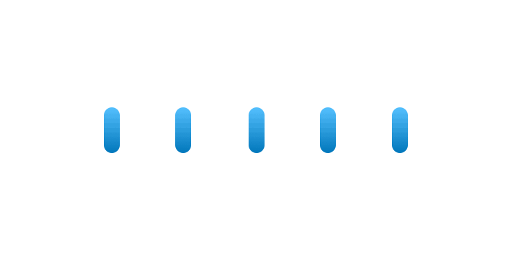
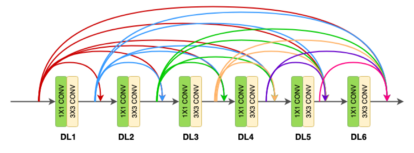
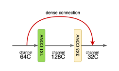
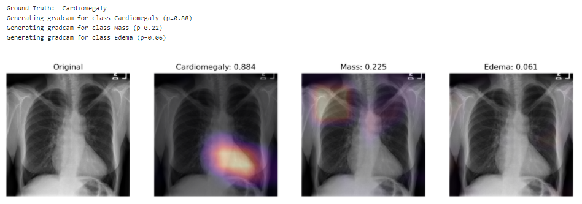
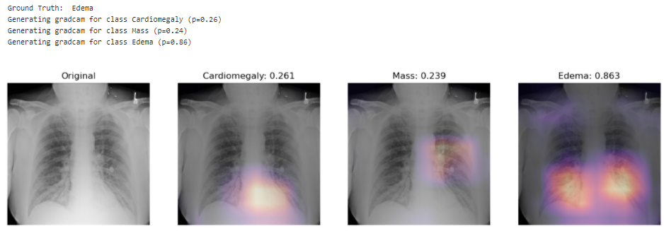

# Chest-X-Ray-Medical-Diagnosis-with-Deep-Learning
Diagnose 14 pathologies on Chest X-Ray using Deep Learning. Perform diagnostic interpretation using GradCAM Method

# Project Description
This project is a complilation of several sub-projects from Coursera 3-course [IA for Medical Specialization](https://www.coursera.org/specializations/ai-for-medicine). The objective is to use a deep learning model to diagnose pathologies from Chest X-Rays.

The project uses a pretrained DenseNet-121 model able to diagnose 14 labels such as Cardiomegaly, Mass, Pneumothorax or Edema. In other words, this single model can provide binary classification predictions for each of the 14 labeled pathologies.

Weight normalization is performed to offset the low prevalence of the abnormalities among the dataset of X-Rays (class imbalance).

Finally the GradCAM technique is used to highlight and visualize where the model is looking, which area of interest is used to make the prediction. This is a tool which can be helpful for discovery of markers, error analysis, and even in deployment.

# Dataset

The project uses chest x-ray images taken from the public [ChestX-ray8 dataset](https://arxiv.org/abs/1705.02315). This dataset contains 108,948 frontal-view X-ray images of 32,717 unique patients. Each image in the data set contains multiple text-mined labels identifying 14 different pathological conditions.
These in turn can be used by physicians to diagnose 8 different diseases.
For the project we have been working with a ~1000 image subset of the images.
- 875 images to be used for training.
- 109 images to be used for validation.
- 420 images to be used for testing.

The dataset includes a CSV file that provides the ground truth labels for each X-ray.

# DenseNet highlights

DenseNet was introduced in 2017 in an award-winning paper by Gao Huang et al. 2018 called [Densely Connected Convolutional Networks](https://arxiv.org/pdf/1608.06993.pdf). The model was able to outperform previous architectures like ResNet (which I covered in a previous project xxxxx). Regardless of the architectural designs of these networks, they all try to create channels for information to flow between the initial layers and the final layers. DenseNet, with the same objective, create paths between the layers of the network.

- DenseNet key novelty:
Densenet is a convolutional network where each layer is connected to all other layers that are deeper in the network
  - The first layer is connected to the 2nd, 3rd, 4th etc.
  - The second layer is connected to the 3rd, 4th, 5th etc.
Each layer in a dense block receives feature maps from all the preceding layers, and passes its output to all subsequent layers. Feature maps received from other layers are fused through concatenation, and not through summation (like in ResNets). Extracted feature maps are continuously added together with previous ones which avoids redundant and duplicate work.

This allows the network to re-use learned information and be more efficient. Such networks require fewer layers. State of the art results are achieved with as low as 12 channel feature maps. This also means the network has fewer parameters to learn and is therefore easier to train. 
Amongst all variants, DenseNet-121 is the standard one. 

Key contributions of the DenseNet architecture:
•	Alleviates vanishing gradient problem ( as networks get deeper, gradients aren’t back-propagated sufficiently to the initial layers of the network. The gradients keep getting smaller as they move backwards into the network and as a result, the initial layers lose their capacity to learn the basic low-level features)
•	Stronger feature propagation
•	Feature re-use
•	Reduced parameter count

# DenseNet architecture

DenseNet is composed of Dense blocks. In those blocks, the layers are densely connected together: Each layer receive in input all previous layers output feature maps.
-	Dense block
A dense block comprises n dense layers. These dense layers are connected such that each dense layer receives feature maps from all preceding layers and passes it’s feature maps to all subsequent layers. The dimensions of the features (width, height) stay the same in a dense block.

-	Dense layer
Each dense-layer consists of 2 convolutional operations -
•	1 X 1 CONV (conventional conv operation for extracting features)
•	3 X 3 CONV (bringing down the feature depth/channel count)

The  CONV layer in the table corresponds to the sequence BatchNorm→ReLU→Conv. A layer has each sequence repeated twice, the first with 1x1 Convolution bottleneck producing: grow rate x 4 feature maps, the second with 3x3 convolution. The authors found that the pre-activation mode (BN and ReLU before the Conv) was more efficient than the usual post-activation mode.
The growth rate (k= 32 for DenseNet-121) defines the number of output feature maps of a layer. Basically the layers output 32 feature maps which are added to a number of 32 feature maps from previous layers. While the depth increases continuously, each layer bring back the depth to 32.

The DenseNet-121 comprises 4 dense blocks, which themselves comprise 6 to 24 dense layers. 

-	Transition layer
In between dense blocks, you find Transition layer.
Instead of summing the residual like in ResNet, DenseNet concatenates all the feature maps.
In each dense block, the feature maps of each layer has the same size.
Transition layers between two dense blocks assure the down-sampling role (x and y dimensions halved), essential to CNN.
A transition layer is made of:
1.	Batch Normalization
2.	1x1 Convolution
3.	Average pooling
Although Concatenating generates a lot of input channels, DenseNet’s convolution generates a low number of feature maps (The authors recommend 32 for optimal performance but world-class performance was achieved with only 12 output channels).
Transition layers compress the feature map and reduce the channels by half. This contributes to the compactness of the network.

Key benefits:
-	Compactness. DenseNet-201 with 20M parameters yields similar validation error as a 101-layer ResNet with 45M parameters.
-	The learned features non-redundant as they are all shared through a common knowledge. 
-	Easier to train because deep network with the dense connections because the gradient is flowing back more easily thanks to the short connections.

320x320 = weights

# Environment and dependencies
In order to run the model, I used an environment with tensorflow 1.15.0 and Keras 2.1.6.

# Results
I used a pre-trained model which performance can be evaluated using the ROC curve shown at the bottom. The best results are achieved for Cardiomegaly (0.9 AUC), Edema (0.86) and Mass (0.82). Ideally we want to be significantly closer to 1. You can check out below the performance from the ChexNeXt paper and their model as well as radiologists on this dataset.

Looking at unseen X-Rays, the model correctly predicts the predominant pathology, generating a somehow accurate diagnotic, highlighting the key region underlying its predictions. In addition to the main diagnostic (highest prediction), the model also predicts secondary issues similarly to what a radiologist would comment as part of his analysis. This can be either false positive from noise captured in the X-rays or cumulated pathologies.

The model correctly predicts Cardiomegaly and absence of mass or edema. The probability for mass is higher, and we can see that it may be influenced by the shapes in the middle of the chest cavity, as well as around the shoulder.

The model picks up the mass near the center of the chest cavity on the right. Edema has a high score for this image, though the ground truth doesn't mention it.

Here the model correctly picks up the signs of edema near the bottom of the chest cavity. We can also notice that Cardiomegaly has a high score for this image, though the ground truth doesn't include it. This visualization might be helpful for error analysis; for example, we can notice that the model is indeed looking at the expected area to make the prediction.

Performance from the ChexNeXt paper (model as well as radiologists):

