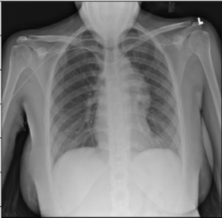
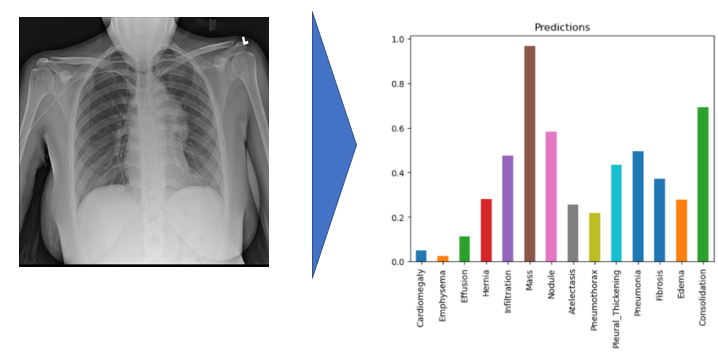

# Chest-X-Ray-Medical-Diagnosis-with-Deep-Learning
Diagnose 14 abnormalities on Chest X-Ray using Deep Learning. Perform diagnostic interpretation using GradCAM Method

# Project Description
This project is a complilation of several sub-projects from Coursera 3-course [IA for Medical Specialization](https://www.coursera.org/specializations/ai-for-medicine).

dataset used....

The objective is to use a deep learning model to diagnose abnormalities from Chest X-Rays.
The project uses a pretrained DenseNet-121 model able to diagnose between 14 labels such as Cardiomegaly, Mass, Pneumothorax or Edema.

Weight normalization is performed to offset the low prevalence of the anomalies among the dataset of X-Rays.

Finally the GradCAM technique is used to highlight and visualize where the model is looking, whhat is the area of interest used to make the prediction. This is a tool which can be helpful for discovery of markers, error analysis, and even in deployment.

# DenseNet highlights

!   

# Environment and dependencies
In order to run the model, I used an environment with tensorflow 1.15.0 and Keras 2.1.6.

# Results
I used a pre-trained model which performance can be evaluated using the ROC curve below. The best results are achieved for Cardiomegaly (0.9), Edema (0.86) and Mass (0.82).
Looking at unseen X-Rays, the model correctly predicts the predominant abnormality, generating a somehow accurate diagnotic and highlight accurately the key region of interest.

The model correctly predicts Cardiomegaly and absence of mass or edema. The probability for mass is higher, and we can see that it may be influenced by the shapes in the middle of the chest cavity, as well as around the shoulder.

The model picks up the mass near the center of the chest cavity on the right. Edema has a high score for this image, though the ground truth doesn't mention it.

Here the model correctly picks up the signs of edema near the bottom of the chest cavity. We can also notice that Cardiomegaly has a high score for this image, though the ground truth doesn't include it. This visualization might be helpful for error analysis; for example, we can notice that the model is indeed looking at the expected area to make the prediction.

